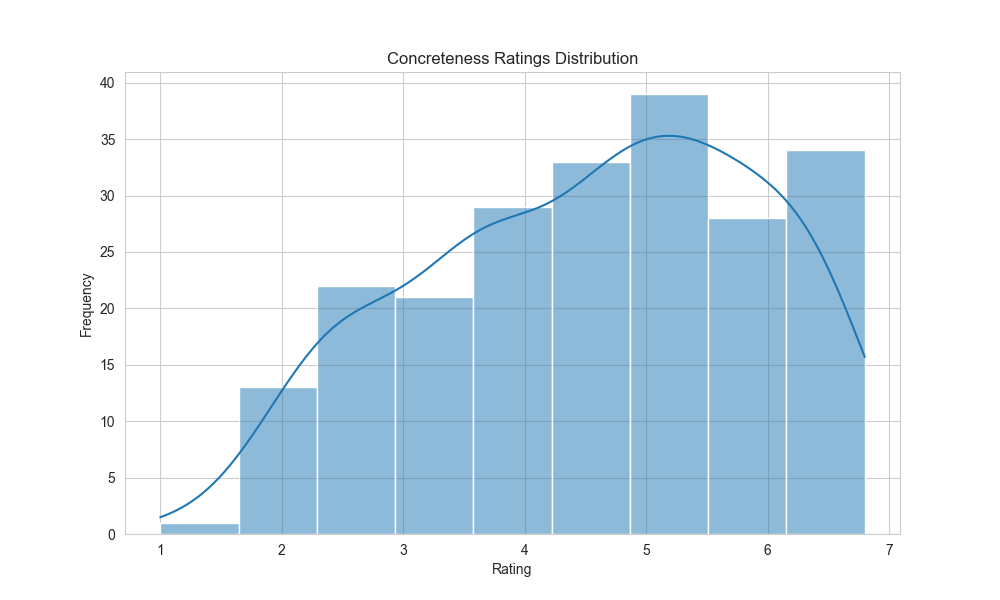

## IRR (Krippendorff’s α)
- **Imageability:** ~0.35  
- **Concreteness:** ~0.39  
- Restricting to sentences rated by ≥5 annotators does not increase agreement.
- around 1.3-4 avg. SD/subject

If we **force them to a 5-point scale**, we get:
- **Imageability:** ~0.33  
- **Concreteness:** ~0.38

### Comparison to prior work
Low but fairly consistent; aligns with values reported; for imageability: at the [sentence level](https://gaurav22verma.github.io/text-visualness/assets/TextVisualness.pdf) and [expression level](https://www.frontiersin.org/journals/psychology/articles/10.3389/fpsyg.2019.01075/full); and there are comparable ICC scores for concreteness.

**Dictionaries**: Paivio (1968)(doi:10.1037/h0025327) split raters into two balanced subgroups, averaged ratings within each subgroup, and then correlated these means; high correlations (r ≈ 0.94) indicated strong inter-rater reliability. If we do as they do (now i've random-splitted into 2 groups 50 times and averaged the correlations), we get:

**Imageability:** r ≈ 0.71 
**Concreteness:** r ≈ 0.73

### Interpretation
- Moderate α reflects the subjective nature of sentence-level judgments rather than flaws in the data.  
- Annotators likely use different criteria in making ratings, leading to a wide distribution of responses.  
- Reducing scale granularity (e.g., 7 → 5 points) slightly lowers α. So it would seem **disagreements are fundamental, not just about decimal points**

### Sensory Modality Annotations (~500 annotations)
- Sparse data; most modalities have few sentences with multiple annotations, making α unstable.  
- Only **TASTE** and possibly **SMELL** show moderate agreement.  
- Two modalities stand out with particularly low α:  
  - **Internal bodily sensations:** often confused with emotions --> might be why low α
  - **Sight:** higher SD and more ratings, reflecting salience of this sense
- General hierarchy: salient modalities (SIGHT, SOUND) → more ratings and higher SD; rare modalities (TASTE, SMELL) → sparse and lower α.

